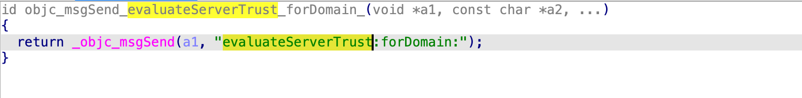
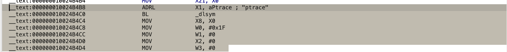
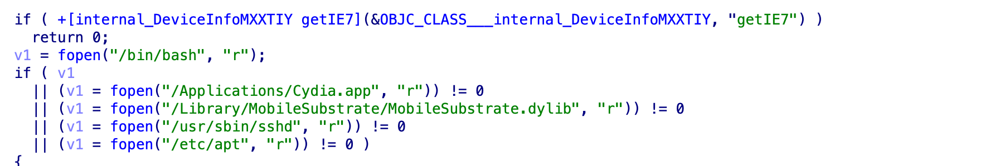
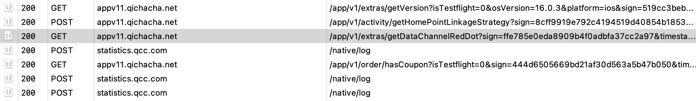

### SSL检测绕过


这个是ios常用的ssl检测方式,以下是基本的汇编

以下是具体的绕过的hook点
```
function hook(className, methodName, replacement) {
        var clazz = ObjC.classes[className];
        if (!clazz) return;
        var method = clazz[methodName];
        if (!method) return;
        Interceptor.attach(method.implementation, {
            onLeave: function (retval) {
                try {
                    retval.replace(ptr(replacement));
                } catch (e) { }
            }
        });
    }
```
### 越狱检测初始化



这个都是常见的越狱检测的手段,你们看下

```
["BMKBaseSecurityPolicy", "AFSecurityPolicy", "WPKAFSecurityPolicy", "QCCSecurityPolicy"]
```
直接调用的方法和逻辑



